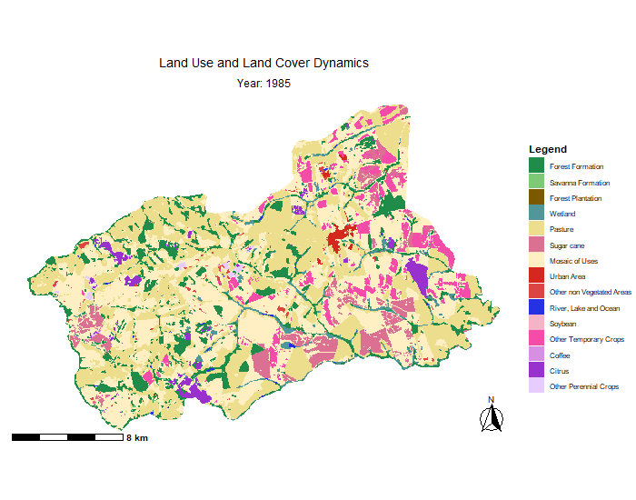

# lulcBR

<!-- badges: start -->
<!-- badges: end -->

## Overview

`lulcBR` is an R package for processing Brazilian land use and land cover (LULC) data from the annual MapBiomas Collection 10.
The package provides tools to access, visualize, and export LULC dynamics data over time (1985–2024) using direct cloud access, with no local downloads required.

```{r setup, include=FALSE}
knitr::opts_chunk$set(
  collapse = TRUE,
  comment = "#>",
  message = FALSE,
  warning = FALSE
)

devtools::load_all()
```

## Installation

You can install the development version of `lulcBR` from GitHub.

```{r install, eval=FALSE}
library(devtools)
install_github("jaquelinepolvani/lulcBR")
library(lulcBR)
```

## Getting started

All functions in lulcBR require an Area of Interest (AOI) defined as either an `sf` or `SpatVector` object.
The package automatically checks and reprojects the CRS when needed.
Class definitions and color schemes follow the MapBiomas Collection 10 standard.

## Creating an AOI 
Below are examples of how to create AOIs from Brazilian municipalities using`{geodata}`.

```{r message=FALSE, warning=FALSE}
library(geodata)

muni <- gadm(country="BRA", level=2, path=tempdir())

bozano <- muni[muni$NAME_2 == "Bozano", ] 
colina <- muni[muni$NAME_2 == "Colina", ] 
raposa <- muni[muni$NAME_2 == "Raposa", ] 
```

You can also define a custom AOI polygon. Below is an example for a location in Peixoto de Azevedo (MT, Brazil), within the Amazon Deforestation Arc.

```{r}
library(terra)

# Center coordinates (longitude, latitude)
center_lon <- -54.6603
center_lat <- -10.4100
half_side <- 0.05  # degrees

# Create an extent object
ext <- ext(center_lon - half_side, center_lon + half_side,
           center_lat - half_side, center_lat + half_side)

# Convert to a SpatVector polygon
aoi <- as.polygons(ext, crs = "EPSG:4326")
```

## Functions overview
| Function | Description | Key Arguments | Output |
|:---|:---|:---|:---|
| `lulc_aoi()` | Extracts land use/land cover data for a given AOI | `aoi`, `year` | `SpatRaster` / Map / Data frame |
| `groups_transition()` | Maps aggregated land cover transitions between two years | `aoi`, `year1`, `year2` | `SpatRaster` / Map / Data frame |
| `forest_transition()` | Maps forest cover transitions over time | `aoi`, `year1`, `year2` | `SpatRaster` / Map / Data frame |
| `def_drivers_transition()` | Maps deforestation drivers | `aoi`, `year1`, `year2` | `SpatRaster` / Map / Data frame |
| `class_stability()` | Analyzes pixel-level stability (number of changes) | `aoi`, `years` | `SpatRaster` / Map / Data frame |
| `lulc_animation()` | Creates an animated GIF of annual land cover maps | `aoi`, `years` | `.gif` file |
| `lulc_timeseries()` |  Produces a stacked area or line plot of annual land cover composition | `aoi`, `years`, `plot_type` | Stacked area or line plot |
| `transition_matrix()` | Calculates land cover transition matrix in hectares | `aoi`, `year1`, `year2` | CSV file |

## Examples

### Static maps

Functions such as `lulc_aoi()`, `groups_transition()`, `forest_transition()`, `def_drivers_transition()`, and `class_stability()` generate static maps.

Example: deforestation drivers map for an aoi in Peixoto de Azevedo (1985–2024).

```{r deforestation-map, fig.width=7, fig.height=6}
def_drivers_transition(aoi, 1985, 2024)
```

The `class_stability()` function analyzes how many times each pixel changed class during the selected period.

Example: class stability analysis for Bozano (RS):
```{r class-stability-map, fig.width=7, fig.height=6}
class_stability(
  bozano,
  years = 2000:2024,
  title = "LULC Changes in Bozano (2000-2024)"
)
```

### Animated map

`lulc_animation()` creates a GIF showing annual land cover change over time.

```{r echo=TRUE, eval=FALSE}
lulc_animation(
  colina,
  years = 1985:2024,
  output_file = "colina.gif"
)
```



### Plots

`lulc_timeseries()` generates a stacked area plot of land cover composition over time. 

```{r lulc-timeseries, fig.width=8, fig.height=5}
lulc_timeseries(
  colina,
  years = 1985:2024
)
```

### Transition matrix (CSV output)

`transition_matrix()` calculates a land cover transition matrix (in hectares) between two years and exports the result as a CSV file.

```{r echo=TRUE, eval=FALSE}
transition_matrix(
  raposa,
  2019,
  2020
)
```


## Notes

- An internet connection is required.
- This package is intended for educational use.

## References

MapBiomas Project (2025). Collection 10 of the Annual Land Use and Land Cover Maps of Brazil.  
https://brasil.mapbiomas.org/en/

## License

MIT © 2025 Jaqueline Polvani
