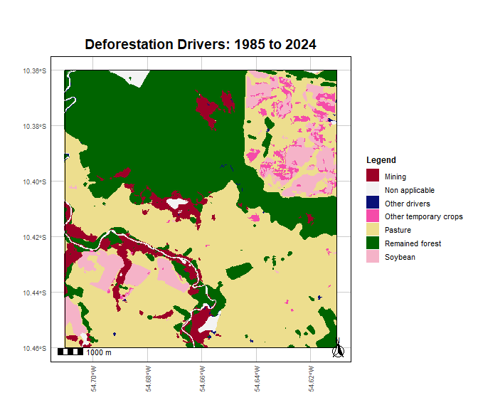
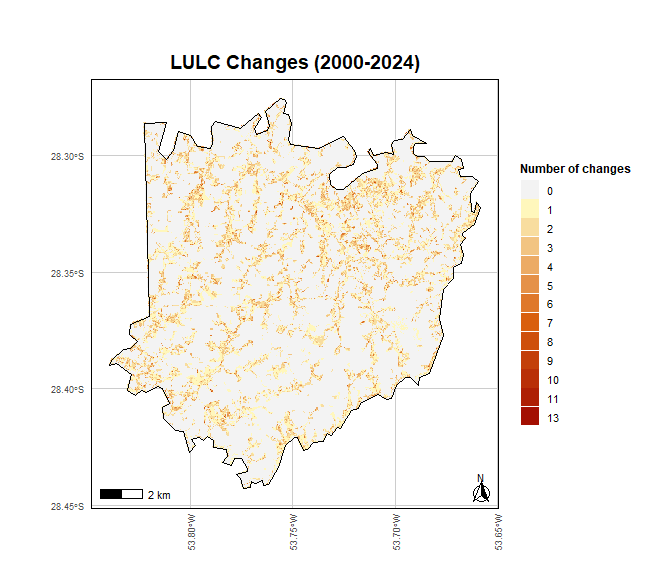
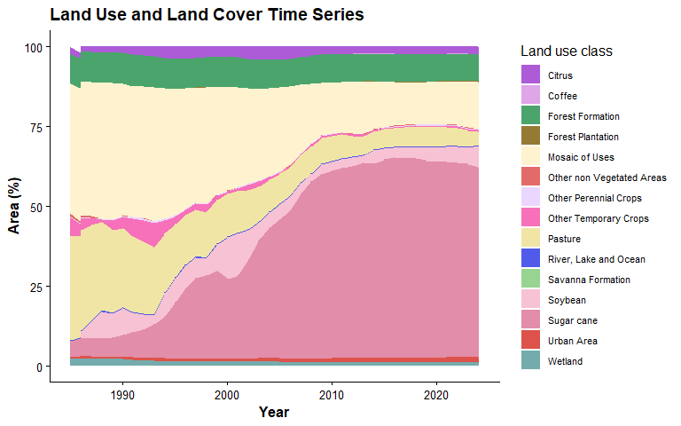

# lulcBR

<!-- badges: start -->

<!-- badges: end -->

## Overview

`lulcBR` is an R package for processing and visualizing Brazilian land
use and land cover (LULC) data from the annual MapBiomas Collection 10.

The package provides tools to access, analyze, and visualize LULC
dynamics data over time (1985–2024) using direct cloud access, with no
local downloads required.

## Installation

You can install the development version of `lulcBR` from GitHub:

``` r
library(devtools)

install_github("jaquelinepolvani/lulcBR")

library(lulcBR)
```

## Using lulcBR

To run the functions, you need an area of interest (AOI) as an `sf` or
`SpatVector` object.

The functions automatically check and reproject the CRS when needed.
Classes and color codes follow the MapBiomas Collection 10 standard.

Below is an example showing how to create AOIs from Brazilian
municipalities using `{geobr}`.

``` r
library(geobr)
library(terra)

muni <- read_municipality()

bozano <- subset(muni, name_muni == "Bozano") |> vect() 
colina <- subset(muni, name_muni == "Colina") |> vect() 
raposa <- subset(muni, name_muni == "Raposa") |> vect()
```

## Examples

### Static maps

Functions such as `lulc_aoi()`, `groups_transition()`,
`forest_transition()`, `def_drivers_transition()`, and
`class_stability()` generate static maps.

Below is a deforestation drivers map for Peixoto de Azevedo (MT,
Brazil), in the Amazon Deforestation Arc (1985–2024).

``` r
def_drivers_transition(aoi, 1985, 2024)
```

<!-- -->

The `class_stability()` function analyzes how many times each pixel
changed class during the selected period.

Example for Bozano (RS):

``` r
class_stability(
  bozano,
  years = 2000:2024
)
```

<!-- -->

### Animated map

`lulc_animation()` creates a GIF showing annual land cover change over
time.

``` r
lulc_animation(
  colina,
  years = 1985:2024,
  output_file = "colina.gif"
)
```


### Plots

`lulc_timeseries()` generates a stacked area plot of land cover
composition over time. `trend_analysis()` produces linear trend plots
for grouped classes.

``` r
lulc_timeseries(
  colina,
  years = 1985:2024,
  plot_type = "area"
)
```

<!-- -->

### Transition matrix (CSV output)

`transition_matrix()` calculates a transition matrix (in hectares) and
exports the result as a CSV file.

``` r
transition_matrix(
  raposa,
  2000,
  2020,
  output_dir = "./results"
)
```

## Notes

- An internet connection is required.
- This package is intended for educational use.

## References

MapBiomas Project (2025). Collection 10 of the Annual Land Use and Land
Cover Maps of Brazil.  
<https://brasil.mapbiomas.org/en/>

## License

MIT © 2025 Jaqueline Polvani
